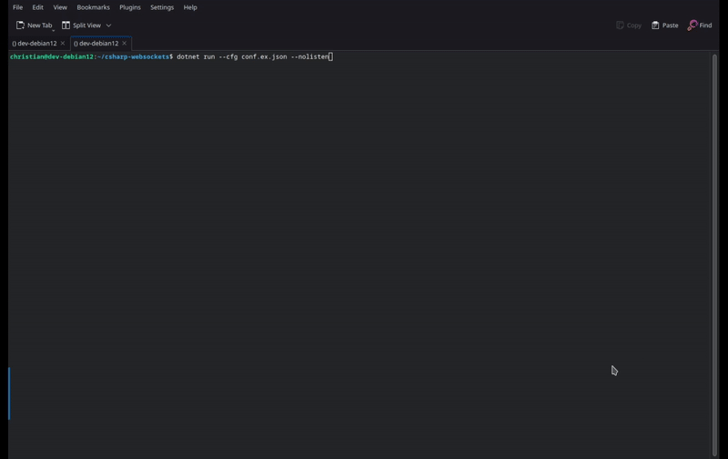

This is a small project that utilizes CSharp and the [.NET library](https://dotnet.microsoft.com/en-us/learn/dotnet/what-is-dotnet) (7.0). This program allows you to establish multiple web sockets at once (client -> server and server -> client both supported). This is intended to run on Linux-based operating systems that support .NET 7.0 (e.g. using the `dotnet` package). This project should work with .NET 8.0 as well, but I haven't tested it.

This program operates as a very simple one-on-one chat room. When connected, the client and server can exchange basic UTF-8 text messages with each other.

I made this project to learn more about web sockets in CSharp/.NET along with how to manage multiple web sockets receiving/sending data concurrently via asynchronous methods.

## Demo
Here's a GIF video demonstrating the functionality of the program. We don't use SSL in our demonstration and establish the client and server both locally using `127.0.0.1` (localhost).



## Building & Installing
### Prerequisites
#### .NET 7.0
The .NET 7.0 library is required to run this project. You can install this library manually or through a package manager if your Linux distro supports it.

On Ubuntu/Debian-based systems, you may install Dotnet using the below command(s).

```bash
# Typically this is only required for Debian.
wget https://packages.microsoft.com/config/debian/12/packages-microsoft-prod.deb -O packages-microsoft-prod.deb
sudo dpkg -i packages-microsoft-prod.deb
rm packages-microsoft-prod.deb
sudo apt update

# Install .NET 7.0.
sudo apt install -y dotnet-sdk-7.0
```

#### Building & Running
If you want to build and run the project. You can use the following command.

```bash
dotnet run
```

If you want to only build the project, you can use the following command.

```bash
dotnet build
```

Make sure you're in the same directory as the `csharp-websockets.csproj` file when performing the above commands.

## Command Line
The following command line arguments are supported.

* **-z --cfg** => The path to the config file. By default, it looks for `./conf.json`.
* **--nolisten** => Prevents the listen server from activating.
* **--host** => Overrides the host address to listen on.
* **--port** => Overrides the port to listen on.
* **--ssl** => Overrides the listen SSL option.
* **-l --list** => Lists all values of config and exits. 

## Configuration
A config file on the file system is read and parsed via the JSON syntax. The default path it checks for is `./conf.json`. However, it can be changed via the config path command line option listed above.

Here are the config options. Please keep in mind you will need to remove the comments (`//`) if copying below. I recommend taking a look at the [conf.ex.json](./conf.ex.json) file if you want to copy the configuration without any errors.

```json
{
    // Whether to activate the listen server.
    "listen": true,

    // The host to listen on.
    "listenHost": "127.0.0.1",

    // The port to listen on.
    "listenPort": 2222,

    // Whether to listen with SSL.
    "listenSsl": false,

    // An array of startup client connections.
    "startupConnections": [
        {
            // The startup connection host.
            "host": "127.0.0.1",
            
            // The startup connection port.
            "port": 2223,

            // Whether to use SSL with the startup connection.
            "ssl": false
        }
    ]
}
```

## Usage
When starting up the program, you will be prompted with the following commands you can use.

* **ls** - List all server connections. The number at the beginning represents the index which should be used with other commands.
* **lc** - List all client connections. The number at the beginning represents the index which should be used with other commands.
* **new `<ip>` `<port>` `<ssl>`** - Establish a new client connection to `<ip>`:`<port>`. `<ssl>` is optional and to disable SSL, use **no**.
* **cc `<idx>`** - Send/receive messages for client connection at index `<idx>`.
* **cs `<idx>`** - Send/receive messages for listen server at index `<idx>`.
* **rc `<idx>`** - Remove client at index `<idx>`.
* **rs `<idx>`** - Remove server at index `<idx>`.
* **h** - Print top/help menu.
* **q** - Exit program.

When connected to a chat session via the `cc` and `cs` commands, you can send the message `\q` to detach the current chat session and return to the main menu.

## Notes
* This project is still a work in progress. I have not yet tested SSL.
* Only one connection to the listen server is supported at the moment. New connections will override the previous connection. However, I may add support for multiple connections in the future when I have more time.

## Credits
* [Christian Deacon](https://github.com/gamemann)